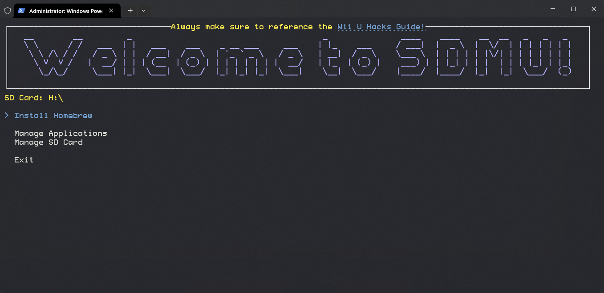

# SDMU (SD Manager (Wii) U)



SDMU is designed to make Wii U homebrew management easy. Gone are the days of managing your files manually. Use SDMU to install packages directly from the Homebrew App Store, manage backups, and more.

## Features

- **SD Card Management:** Create backups, clean up bloat, and restore different SD Card configurations seamlessly.
- **Offline File Updates:** Download and update your homebrew applications offline from a PC.
- **Homebrew App Store Integration:** Install packages offline onto your SD Card from the Homebrew App Store.

## Compiling

### Prerequisites

- [.NET Core SDK](https://dotnet.microsoft.com/download)

### Building from Source

1. Clone the repository:
   ```bash
   git clone https://github.com/sunryze-git/SDMU.git
   ```

2. Navigate to the project directory:
   ```bash
   cd SDMU
   ```

3. Build the project:
   ```bash
   dotnet build
   ```

## Usage

1. Run the compiled executable or launch the application from your preferred development environment.
2. Follow the on-screen instructions.

## License

This project is licensed under the [MIT License](LICENSE.txt).

## Thanks To

- Aroma, Tiramisu, HB App Store
- Any other package that is downloaded through this software
